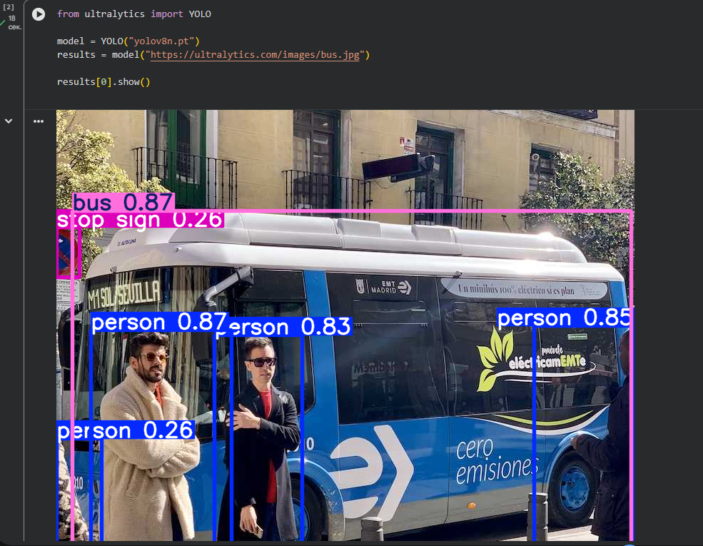
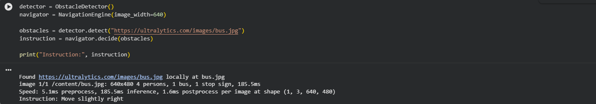
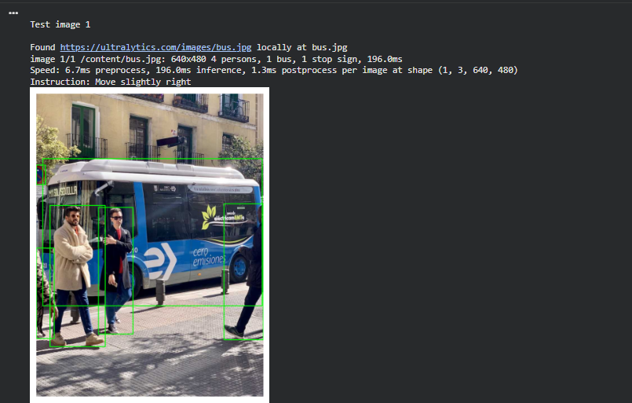
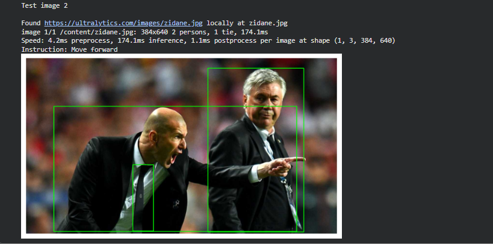

# Obstacle-Aware Navigation Assistant

## Problem
Navigating unfamiliar environments safely is challenging, especially for visually impaired people.

## Approach
- Detect obstacles in an image using YOLOv8
- Apply rule-based logic to generate movement instructions
- Prototype tested on sample images

## Technologies
- Python
- YOLOv8 (ultralytics)
- OpenCV
- Rule-based navigation logic

## Results
- Successfully detects obstacles
- Provides textual navigation instructions
- Fully functional prototype in Colab

## Limitations
- No depth perception
- Single-frame analysis
- Rule-based decisions only

## Next Steps
- Integrate real-time video input
- Improve navigation logic using AI
- User testing and feedback

## Results
The system was tested on multiple images containing people, vehicles, and urban obstacles.
It consistently detected obstacles and generated navigation instructions based on their positions and relative sizes.

